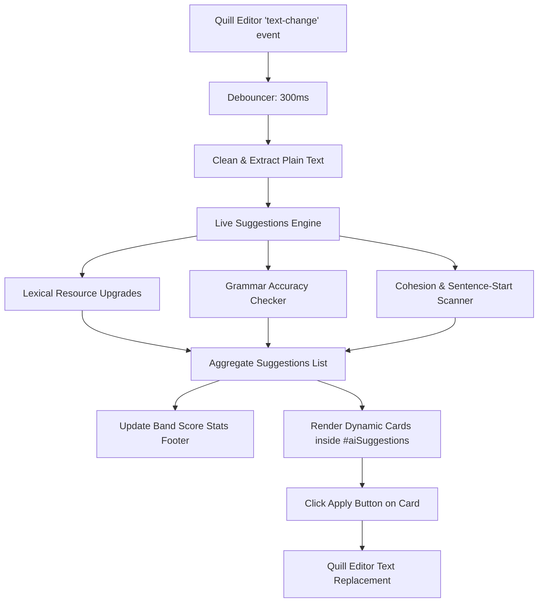

# Design Spec: IELTS Writing Studio - Real-time Live Suggestions Engine & Editor Integration

## 1. Goal & Context
The current IELTS Writing Practice Studio features a static mock UI for "Live Suggestions." The suggestions do not change based on the student's actual text, and clicking the apply button does not perform any changes in the editor. 

We need to implement a fully dynamic, real-time client-side analysis engine that evaluates grammar, vocabulary upgrades (Lexical Resource), and sentence cohesion, with instant "click-to-apply" replacements directly inside the Quill editor.

---

## 2. Architectural Design 

The engine will operate entirely on the client-side (JavaScript) to ensure lightning-fast, zero-latency feedback on every keystroke without overloading the C# backend server.



### 2.1 Sentence Parser & Normalization
To prevent percentage figures or other decimals (common in Task 1) from breaking sentence segmentations (e.g. `5.5%` or `12.5 tonnes`), we segment sentences using a positive lookbehind that splits on `.`, `?`, or `!` followed by spaces, while excluding decimal patterns:
```javascript
const sentenceSplitRegex = /(?<=[.!?])\s+(?=[A-Z])/g;
```

---

## 3. Dynamic Rule Schemes

### 3.1 Lexical Resource Upgrades (Vocab Upgrades)
Tracks generic/weak words and provides academic IELTS alternatives. We track each weak word using standard Regular Expressions with word-boundary (`\b`) guards:

| Weak Phrase / Pattern | Advanced Academic Upgrade | Target Band Boost |
| :--- | :--- | :--- |
| `went up very fast` / `rose fast` | `experienced a sharp increase` | 7.0+ |
| `went up fast` / `increased fast` | `increased rapidly` | 7.0+ |
| `went down` | `decreased significantly` | 7.0+ |
| `shows` / `show` | `illustrates` / `illustrate` | 7.5+ |
| `big` | `substantial` | 7.0+ |
| `small` | `negligible` | 7.0+ |
| `many` | `numerous` | 7.0+ |
| `a lot of` | `a multitude of` | 7.5+ |
| `good` | `beneficial` | 7.0+ |
| `bad` | `detrimental` | 7.0+ |
| `important` | `crucial` | 7.5+ |

### 3.2 Grammatical Accuracy warnings
Detects common subject-verb agreement or incorrect preposition pairings:

| Pitfall / Error Pattern | Correct Replacement | Rationale |
| :--- | :--- | :--- |
| `people is` | `people are` | "People" is a plural noun. |
| `(he / she / it) have` | `has` | Third-person singular requires "has". |
| `there is (many / some / numerous / several)` | `there are` | Plural indicator requires plural verb. |
| `affect on` | `affect` / `influence` | "Affect" is a transitive verb; does not take "on". |

### 3.3 Cohesion & Coherence Trap Scanner
- **Consecutive Sentence-Start Trap:** Scans consecutive sentences to ensure they do not start with the same case-insensitive word (e.g., "The chart shows...", "The chart illustrates...").
- **Linking Word Checklist:** Checks if the essay has zero linking words (e.g., `however`, `furthermore`, `moreover`, `in contrast`, `consequently`, `on the other hand`, `in addition`) and prompts the user to add them.

---

## 4. UI Rendering & Interactive Editor Application

### 4.1 HTML Template Injection
We will replace the static, hardcoded cards with a container populated via a Javascript render loop:
- **Lexical Upgrade:** Sleek indigo card with matching icon and apply button.
- **Grammar Warning:** Emerald card with target error highlight and apply button.
- **Cohesion Hint:** Amber card giving tips to improve flow.

### 4.2 Interactive Text Replacement (Apply Suggestion)
The apply button invokes a global utility:
```javascript
window.applySuggestion = function(startIdx, length, replacement) {
    if (!window.quill) return;
    
    // Double check that the index is still within bounds
    const currentText = window.quill.getText();
    
    // Delete the matched weak text and insert the upgrade
    window.quill.deleteText(startIdx, length);
    window.quill.insertText(startIdx, replacement);
    
    // Set selection just after the replacement to maintain focus
    window.quill.setSelection(startIdx + replacement.length);
};
```

---

## 5. Verification Plan

### 5.1 Manual Verification
1. **Dynamic Generation:** Type *"The graph shows a big rise."* Verify that lexical cards for `"shows"` (suggesting *"illustrates"*) and `"big"` (suggesting *"substantial"*) appear in the sidebar.
2. **Apply Replacements:** Click the apply (plus/checkmark) button on the `"big"` card. Verify that the editor content instantly updates to *"The graph shows a substantial rise."* and the card disappears.
3. **Cohesion Hint:** Type *"The chart shows energy use. The chart also shows water use."* Verify that an amber Cohesion Hint warning about consecutive sentence starts appears.
4. **Band Score Feedback:** Verify that the footer band indicators update dynamically as weak vocabulary is removed or corrected.
