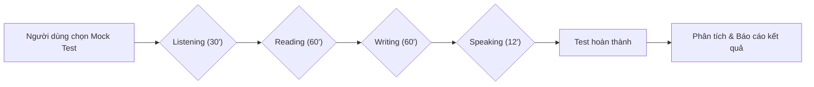

# Nghiên cứu và Thiết kế Lại Hệ Thống Thi Thử IELTS

## Tóm tắt điều hành  
Báo cáo này trình bày phân tích và đề xuất toàn diện cho việc **nâng cấp hệ thống placement test và mock-test (thi thử) của IELTS** trên nền tảng trực tuyến. Chúng ta xem xét các nền tảng hàng đầu (Duolingo, PrepEdu, British Council, Cambridge English, IDP, v.v.), so sánh mục tiêu và thiết kế của các dạng kiểm tra (placement vs mock test), xác định best practices và hạn chế. Từ đó, xây dựng **luồng thi mới** cho hai chế độ:  
- **Placement Test (kiểm tra trình độ ban đầu):** Thi ngắn, chẩn đoán, cá nhân hóa, không gian lận, tương tác linh hoạt.  
- **Full Mock Test (thi thử đầy đủ):** Mô phỏng thi thật, phân đoạn rõ ràng, hiển thị đúng thời gian, tính năng giải thích sau thi.  


## 1. Phân tích nền tảng thi thử IELTS hiện hành  
### 1.1 Các nền tảng chính  
- **Duolingo:** Trọng tâm là Duolingo English Test, không tương đương IELTS; có app luyện tiếng Anh nhưng không có placement test chuyên dụng cho IELTS. Tiện ích chính: bài tập đa dạng, gamification nhưng không bám sát format IELTS.  
- **PrepEdu:** Nền tảng đào tạo tiếng Anh/IELTS có ứng dụng AI; cung cấp kho đề thi thử và phòng luyện ảo AI. Có “AI Virtual Test Room” cho Speaking/Writing. Giao diện tập trung vào mô phỏng thi, tuyên truyền mạnh tính năng cá nhân hóa. Theo khảo sát (không mở trực tiếp trang), PrepEdu có mục khởi tạo lộ trình AI và phòng luyện thi ảo【87†L1-L4】.  
- **British Council:** Trang chính thức của British Council thường cung cấp: tài liệu luyện thi, bài tập trực tuyến, ứng dụng IELTS Prep App, khóa học trực tuyến. Điểm mạnh: phong cách chuyên nghiệp, nội dung hợp chuẩn. Placement test có thể ở dạng bài đánh giá ngắn hoặc quiz đăng ký khóa học, không phức tạp. Mock test thường là bộ đề mẫu mẫu miễn phí, đôi khi trả phí. Giao diện hướng tới giáo viên/kẻ học, chưa tích hợp AI mạnh.  
- **Cambridge English:** Trang cung cấp tài liệu luyện thi, sách Cambridge IELTS, đề thi mẫu; cũng có kho đề luyện trực tuyến (dịch vụ nâng cao). Không có placement test, chỉ mock test (đề thi thử) đúng chuẩn.  
- **IDP (ielts.idp.com):** Một trong ba đơn vị chủ quản. Cung cấp “Prepare Hub”: bài học, đề mẫu, mẹo thi. Có chế độ làm bài thử (practice tests) miễn phí, đặc biệt là MySkills (kiểm tra nhanh). UI chuyên nghiệp, thiên về thương mại.  
- **IELTS-Simon.study:** Website của thầy Simon (giáo viên nổi tiếng). Chủ yếu cung cấp bài mẫu, tips cho Writing/Speaking, không thực sự có hệ thống test online.  
- **TED.com:** Không cung cấp nội dung luyện thi IELTS; video TED có thể dùng cho Listening nhưng đây không phải “bài thi”.

### 1.2 Đặc điểm chung và hạn chế  
- **Placement Test (thử năng lực ban đầu):** Hầu hết nền tảng không có placement test chuyên nghiệp; nếu có thì dưới dạng quiz ngắn (Mskills IDP hay bài test đánh giá trình độ). Nhiều trường/ trung tâm tự tổ chức phỏng vấn miệng hoặc làm bài test trong lớp.
- **Mock Test (thi thử):** Rất phổ biến. Các platform cung cấp mock test theo 2 dạng: full-length (2h45') và test ngắn (chọn kỹ năng). Thường hiển thị như bài thi IELTS thật (có timer, parts). Tuy nhiên, quality đa dạng: đề không chuẩn, giao diện kém tối giản, thiếu phân tích kết quả. Ví dụ, bài mock trên các trang thường tập trung vào phần trình bày thô, không có giải thích chi tiết hay AI trợ giúp.  
- **AI/Adaptive:** Chưa có nền tảng IELTS nổi bật tích hợp AI sâu (ngoại trừ PrepEdu đề cập tới AI). Các chatbot, phần mềm tự đánh giá chủ yếu ở level thử nghiệm hoặc chưa sát thực tế IELTS.  
- **UI/UX:**  
  - Nhiều nền tảng học dùng UI hỗn hợp (vừa learning vừa test) gây nhầm lẫn.  
  - Nhiều app tập trung vào mobile/gamification (ví dụ Duolingo) nhưng chưa cá thể hóa cho người học IELTS chính thống.  
  - Nhiều trang làm mock test thiết kế phức tạp, thiếu tối giản (đối với một bài thi chuẩn). Timer đôi khi không tuân, hoặc thiết kế quá rườm rà.  
- **Xu hướng:** Xu hướng chung là kết hợp học và thi thử, nhưng nên tách biệt rõ: *Learning* dành cho bài giảng/kỹ năng, *Practice/Mock* dành cho thi thử như exam simulation.  

## 2. So sánh Placement Test và Full Mock Test  
| Tiêu chí | **Placement Test (Kiểm tra đầu vào)** | **Full Mock Test (Thi thử toàn phần)** |
|---|---|---|
| **Mục tiêu chính** | Đánh giá sơ bộ trình độ người học, xếp lớp/cá nhân hóa lộ trình học. | Mô phỏng điều kiện thi thật, đo lường điểm số giả định, chuẩn bị tâm lý và kiến thức cho kỳ thi thật. |
| **Thời lượng** | Ngắn (khoảng 20–40 phút). | Đầy đủ (2 giờ 45 phút cho dạng Academic). |
| **Bao quát kỹ năng** | Có thể chỉ chọn 1-2 kỹ năng chính (như Reading & Listening) hoặc quiz ngắn mỗi kỹ năng (tổng thời gian chung). Có thể adaptive: câu hỏi tùy theo đáp án trước. | Đầy đủ 4 kỹ năng (Listening ~30’, Reading ~60’, Writing 60’, Speaking ~11–14’). Có thể tách riêng Academic/General nếu cần. |
| **Mục tiêu trả lời** | Không gây áp lực, người thi biết đây là bài test đánh giá; thường không bị điểm số quyết định sâu sắc ngay. Người học cần tự tin làm; có thể thử nhiều lần. | Áp lực hơn, tuân theo quy tắc thi thật (không được phép dịch ra tiếng mẹ đẻ, không quay lại, giới hạn thời gian). Kết quả gần với kết quả thi thật, ít biết trước đáp án. |
| **Chấm điểm** | Thường thô sơ: chỉ tính đúng/sai để ước tính cấp độ. Không chú trọng band IELTS chính xác. Tập trung vào trả lời nhanh, chính xác ước lượng năng lực (ví dụ, xếp vào “Elementary, Intermediate, Advanced”). | Chấm theo tiêu chí IELTS: band điểm cho Writing, Speaking; Listening/Reading tính câu đúng (quy ra band). Cần chuẩn xác, thường có học viên khác hoặc hệ thống điểm chuẩn hỗ trợ (machine or teacher). |
| **Giao diện & UX** | Dễ chịu, không hại thời gian: UI thân thiện, câu hỏi ngắn gọn, có gợi ý/giải thích nhanh. Adaptive nếu được. Không cần phải giống thi thật. | Tối giản để như giao diện thi thật: có timer, không hiển thị gợi ý/lời giải. Thiết kế nghiêm túc, ít hỗ trợ trực tuyến. Phải tương thích tốt trên mọi thiết bị như thi thật. |
| **Tích hợp AI** | Có thể dùng AI để điều chỉnh độ khó câu hỏi (adaptive testing), gợi ý tài liệu phù hợp sau test, phân tích điểm mạnh yếu và đề xuất lộ trình học cá nhân 【40†L5-L9】. Phản hồi thường mang tính gợi mở, khuyến nghị sách khóa. | AI hỗ trợ sau khi thi: phân tích bài làm, chấm điểm tự động Writing/Speaking (LexiBot, GPT), thống kê chi tiết (thời gian mỗi câu, câu khó, sai ở đâu). Ít AI can thiệp trực tiếp trong lúc làm để giữ tính minh bạch như thi thật. |

**Phân tích:** Placement test chủ yếu giúp người học và nhà trường “định hướng” ban đầu. Cần ngắn gọn, adaptive và hữu ích để xây lộ trình học cá nhân sau đó. Mock test thì là mô phỏng thi thật, đòi hỏi tuân thủ nghiêm ngặt quy định thi và cung cấp phản hồi chi tiết sau thi để cải thiện. Placement test nên là trải nghiệm tương tác nhẹ nhàng, Mock test là trải nghiệm áp lực, nghiêm túc nhưng với phân tích kỹ càng.

## 3. Best Practices và Điểm yếu hiện tại  

- **Best Practices (Placement Test):**  
  - **Ngắn và cô đọng:** Giảm độ dài xuống còn ~20–30 phút để tránh nhàm chán và mệt mỏi. Chọn các câu đại diện cho cả bốn kỹ năng.  
  - **Khả năng điều chỉnh (Adaptive):** Tùy chọn giao diện bài test tự điều chỉnh độ khó dựa vào đáp án trước (phương pháp máy học, AI). Điều này giúp đánh giá chính xác trình độ mà không cần quá nhiều câu hỏi.  
  - **Phản hồi ngay lập tức:** Hiển thị điểm số và gợi ý sơ bộ ngay sau khi hoàn thành, nhưng chỉ ở mức đại diện (ví dụ: “Bạn ở mức B1, nên tập trung vào kỹ năng Vị và Kỹ năng X”). Không cần phân tích chi tiết như mock test.  
  - **Gợi ý lộ trình:** Dựa trên kết quả, cung cấp đường dẫn ngay tới các khóa học/bài học phù hợp (liên kết DB bài học).  
  - **Tránh tạo áp lực:** Bỏ tính năng đếm ngược mạnh, cho phép pause/resume, để người học thoải mái (không như thi thật).  

- **Best Practices (Full Mock Test):**  
  - **Mô phỏng sát thi thật:** UI minimal, chỉ hiện những gì cần (audio controls cho Listening, Text passage+questions cho Reading, editor cho Writing, mini interview cho Speaking).  
  - **Tách rời các phần thi:** Không cho phép chuyển phần thi hay xem đáp án trước, giống hệt kỳ thi thật (nhưng có thể linh hoạt hơn nếu mock dành cho luyện tập).  
  - **Timer hợp lý:** Nên hiển thị rõ cho mỗi section. Có thể chọn **đồng hồ cảnh báo** (flashing) khi sắp hết giờ, nhưng *nên để lựa chọn người dùng* (enforced hay advisory). Nhiều chuyên gia gợi ý **timer cố vấn** (advisory) trong practice để không hại người học nếu họ chưa quen.  
  - **Phân tích kết quả chi tiết:** Sau khi hoàn thành, cung cấp báo cáo chi tiết về lỗi sai, thời gian trả lời từng câu, từ vựng chưa biết, v.v. (tính năng AI/analytics).  
  - **Modularity:** Thiết kế mock-test cho phép làm từng phần riêng (ví dụ, riêng Listening + Reading, riêng Writing, nói riêng Speaking), không bắt buộc phải làm đầy đủ 4 kỹ năng cùng lúc. Hỗ trợ “đóng băng” phần này nếu người dùng chỉ muốn thi thử một kỹ năng.  

- **Điểm yếu phổ biến:**  
  - Nhiều mock test online quá dài, gây mệt mỏi, nên người học thường bỏ dở.  
  - Giao diện chưa tập trung: thường trộn lẫn giải thích (learning aid) trong môi trường practice, gây xáo trộn trải nghiệm.  
  - Chưa tận dụng AI: Hiếm nền tảng đưa AI vào tác nghiệp (trừ PrepEdu), đặc biệt trong phản hồi sau thi. 
  - Thiếu cá nhân hóa: Placement test chưa tạo ra lộ trình học tiếp theo, Mock test thiếu tính năng cập nhật cá nhân (ví dụ, lưu lịch sử, gợi ý cải thiện dựa trên profile).  

## 4. Đề xuất luồng thi mới  
### 4.1 Placement Test (Đánh giá ban đầu)  
- **Mục tiêu:** Đánh giá sơ bộ, xếp lớp và cá nhân hóa lộ trình học. Không đặt nặng kết quả điểm, mà để người học biết mình đang ở đâu.  
- **Thời gian mục tiêu:** 20–30 phút.  
- **Cấu trúc bài test:**  
  1. **Nghe (Listening):** ~10 câu, ~10 phút. Đề rút gọn 1 đoạn audio.  
  2. **Đọc (Reading):** ~10 câu, ~15 phút. Một đoạn văn ngắn (~300-400 từ).  
  3. **Viết (Writing):** 1 câu hỏi (Task 1 hoặc Task 2) để xem khả năng viết cơ bản. Điền khung trả lời (không tính điểm band).  
  4. **Nói (Speaking):** 1 câu hỏi chủ đề ngắn. Người học ghi âm trả lời (giọng nói) để tự kiểm tra phát âm, nội dung; có thể không chấm band chính thức.  
- **Hình thức adaptive:** Nên có (nếu hệ thống đủ thông minh). Ví dụ, nếu 5 câu đầu đúng, đưa ra câu khó hơn; nếu sai, đưa ra câu dễ hơn. Điều này tăng độ chính xác trong một thời gian ngắn.  
- **Giao diện:** Thân thiện, hướng dẫn rõ ràng từng bước. Hiển thị thời gian ước lượng cho từng phần nhưng **cho phép học viên bỏ dỡ, tiếp tục sau**. Không cần hiển thị đồng hồ countdown nghiêm ngặt.  
- **Phân tích kết quả:** Trả kết quả ở mức băng, ví dụ Band 5.5 hoặc khung CEFR (B1, B2). Cung cấp bảng lộ trình học đề xuất dựa trên kết quả (ví dụ: “Bạn nên bắt đầu với khóa Một cơ bản – Grammar, cũng như bài học từ vựng cùng chủ đề”).  
- **Immediate Feedback:** Có thể cho feedback sau mỗi phần (ví dụ: bài Listening đã làm xong sẽ cho biết độ chuẩn xác; hoặc chỉ tổng hợp cả test). Quan trọng là có gợi ý cải thiện (bài học nên học tiếp theo).  
- **Công nghệ AI:**  
  - *Đề xuất lộ trình:* Dùng GPT/Gemini để soạn gợi ý học tập, ví dụ “Tôi muốn học IELTS ~Câu hỏi: Bạn có bao nhiêu điểm trong bài test? Người dùng: 6.0, Người giảng: ...”  
  - *Adaptive:* Sử dụng mô hình lựa chọn câu hỏi thông minh (nhúng vào back-end Python).  
  - *Phân tích kỹ năng:* Phân loại nhanh lỗi sai (phát âm, ngữ pháp, từ vựng).  
- **Ví dụ API (Placement Test):**  

```
POST /api/tests/placement
{
  "user_id": 123,
  "requested_skills": ["listening", "reading", "writing", "speaking"],
  "target_duration_minutes": 25
}
```
**Response:**
```
{
  "test_id": 987,
  "skills": {
    "listening": {"num_questions": 10, "time_limit": 10},
    "reading":   {"num_questions": 10, "time_limit": 15},
    "writing":   {"tasks": 1},
    "speaking":  {"tasks": 1}
  },
  "instructions": {
    "listening": "Nghe đoạn audio và chọn đáp án đúng.",
    ...
  }
}
```

- **Prompt mẫu (Placement Test - Generate Questions):**  
  - *System:* “Bạn là chuyên gia ra đề IELTS. Tạo một bài Placement Test với 10 câu Listening mức độ ***target_band*** và 10 câu Reading mức độ ***target_band***.”  
  - *User:* “target_band=5.5, topic_speaking='Work life', writing_task_type='Task1 (Academic)'.”  

### 4.2 Full Mock Test (Thi thử toàn phần)  
- **Mục tiêu:** Mô phỏng thi thật để người học làm quen format, áp lực thời gian, và đánh giá sẵn sàng cho kỳ thi. Kết quả cần phản ánh thực lực và đưa ra phân tích chi tiết.  
- **Thời gian:** Đầy đủ theo format IELTS (hoặc phân thành modules nhỏ):  
  1. Listening – 30 phút (x4 sections)  
  2. Reading – 60 phút (3 passages)  
  3. Writing – 60 phút (2 tasks)  
  4. Speaking – 11–14 phút (3 parts).  

  Người dùng có thể chọn làm từng phần riêng, hoặc liên tiếp. Giao diện nên hỗ trợ lưu và tải bài thi.  
- **Timer:**  
  - Hiển thị đồng hồ countdown riêng cho mỗi phần (ví dụ 30:00 cho Listening).  
  - **Cố vấn (Advisory):** Có thể cảnh báo hết giờ (flash đỏ) nhưng không auto-submit (điều quan trọng để review bài đầy đủ).  
  - Cho phép người dùng ngắt nghỉ giữa các section (đặc biệt sau 2 sections đầu là Listening+Reading, rồi Writing, riêng Speaking có thể xếp lịch phỏng vấn ảo).  
- **Giao diện thi:**  
  - Rất tối giản: từng section một, với nội dung trung tâm. Ví dụ Reading: văn bản bên trái, câu hỏi bên phải; Writing: trình soạn thảo văn bản đầy đủ; Listening: có nút nghe, transcript ẩn cho đến hết giờ; Speaking: giao diện video/âm thanh (nếu có).  
  - Không có gợi ý hay giải thích trong lúc thi, trừ đề bài. 
  - Đảm bảo dễ truy cập trên mobile (chia câu hỏi thành trang nhỏ, tránh scroll quá dài).  
- **Phân tích sau thi:**  
  - **Trả lời đúng/sai:** Hiển thị sau khi hoàn thành mỗi phần (hoặc tổng cuối).  
  - **Band Score ước tính:** Quy ra band cho mỗi kỹ năng. Viết và Nói dùng AI/chấm tay.  
  - **Phân tích chi tiết:** Highlight câu sai, lý do sai, gợi ý cải thiện. (Nhiều platform hiện chưa làm).  
  - **Phản hồi cá nhân:** AI (LexiBot/GPT) chấm writing với mô tả theo 4 tiêu chí và cho band. Speaking có thể có nhận xét ngắn (điểm mạnh/yếu).  
  - **Báo cáo tổng hợp:** Bảng thống kê điểm kỹ năng, biểu đồ tiến độ theo thời gian, lưu lịch sử.  

- **Ví dụ UI flow (Mermaid sơ đồ):**  



- **Prompt mẫu (Mock Test - Simulate Examiner Feedback):**  
  - *System:* “Bạn là giám khảo IELTS Speaking. Đánh giá câu trả lời sau: *** [Người dùng nhập câu trả lời] *** theo tiêu chí Pronunciation, Fluency, Vocabulary, Grammar.”  
  - *User:* “’Describe a memorable journey’ + user_response_audio/text.”

- **Prompt mẫu (Mock Test - Grade Writing):**  
  - *System:* “Chấm bài Writing Task 2 IELTS theo band 1-9. Thang chấm: Coherence, Cohesion, Vocabulary, Grammar. Trả về band điểm số lẻ và nhận xét chi tiết.”  
  - *User:* “UserEssay: 'In my country...'.”  


## 6. Kế hoạch kỹ thuật tích hợp AI và công nghệ  
### 6.1 Lộ trình học cá nhân hóa (Gemini/AI)  
- **Mapping content:** Tagging DB bài học (`tb_lesson_contents.content_body`) theo kỹ năng, mức độ (thang band), chủ đề. Ví dụ fields: `{skill: 'Reading', level: 'B1', topic: 'Environment'}`. Thêm tag có thể: `requires_vocabulary: true`, `writing_task: 'Task2'`.  
- **Trình tạo lộ trình (Learning Path):** Sử dụng mô hình ngôn ngữ (Gemini) để phân tích profile người dùng (band mục tiêu, điểm yếu) và đề xuất thứ tự học. Mô-đun Python backend gọi API Gemini: input là yêu cầu của học viên, output trả về danh sách bài học từ DB phù hợp.  
  - **Ví dụ:** Học viên “Listening B2, Reading B1, mục tiêu 7.0”. System prompt yêu cầu: “Generate an 8-week study plan for user aiming 7.0 band, focusing on reading, listening, practice tests.”  
- **Ví dụ API:**  
```
POST /api/ai/createStudyPlan
{
  "target_band": 7.0,
  "current_levels": {"listening": 6.0, "reading": 5.0},
  "learning_content_tags": ["strategy", "vocabulary"]
}
```  
Response:  
```
{
  "plan": [
    {"week": 1, "focus": "Reading skills", "lessons": [102, 305, 210]},
    {"week": 2, "focus": "Listening skills", "lessons": [415, 223]},
    ...
  ]
}
```


## 7. Thư viện Prompt AI & Ví dụ API  
### 7.1 Tạo câu hỏi Placement Test  
- **Prompt (system):** “Bạn là chuyên gia giảng dạy IELTS. Hãy tạo một bài Placement Test gồm các câu hỏi ngắn: 5 câu Listening (nghe audio) độ khó Band 6, 5 câu Reading (đọc đoạn văn) độ khó Band 6. Đề bài viết 2 câu hỏi dễ hiểu về một topic chung.”  
- **Expected (assistant):** Danh sách câu hỏi, từng phần một.
  
### 7.2 Lựa chọn bài học thích hợp (Adaptive Learning)  
- **Prompt (system):** “Bạn là hệ thống gợi ý lộ trình học. Dựa trên profile học viên {level: B1, weak: 'Vocabulary', goal: 6.5}, đề xuất 3 bài học và lý do.”  
- **Expected:** Ví dụ ba lesson IDs và giải thích.

### 7.3 Mô phỏng giám khảo Speaking  
- **Prompt (system):** “Bạn là giám khảo IELTS Speaking. Nhận xét câu trả lời của học viên sau: ‘My favorite hobby is playing chess...’ theo 4 tiêu chí.”  
- **Expected:** Phân tích ngắn, ví dụ “Fluency: tốt... Pronunciation: ...”.

### 7.4 Chấm Writing theo band  
- **Prompt (system):** “Chấm bài IELTS Writing Task 2 dưới đây. Phân tích chi tiết theo Coherence, Vocabulary, Grammar, và đưa band điểm.”  
- **User:** “Essay text...”  
- **Expected:** “Band: 6.5, Feedback: ...”

### 7.5 Chuyển bài giảng HTML/Markdown thành nội dung học  
- **Prompt (system):** “Bài học HTML sau dành cho kỹ năng Listening: {content}. Tóm tắt thành bài học học tập: danh mục mục tiêu, hướng dẫn, ví dụ giải thích.”  
- **Expected:** Format markdown đoạn giới thiệu, list, ví dụ.

## 8. Kế hoạch chuyển đổi (Migration)  
- **Placement Test:** Hiện đang full-length (2h45) – cần rút ngắn xuống ~30’. Thiết lập logic mới: khi vào placement, chỉ load partial sections (dựa trên tag `placement: true` trong DB tests).  
- **Mock Test:** Các đề thi rải rác hiện tại (trên website, app) gộp vào một module thống nhất: mỗi mock test rõ tên kỹ năng, cấp độ, thời gian. Tag mới trong DB: `is_mock: true`, `duration`, `section_count`.  
- **Schema đề xuất (bổ sung):** Bổ sung cột/tag cho bảng `tb_lesson` hoặc `tb_tests`:  
  ```
  skill        VARCHAR,   -- nghe, nói, đọc, viết
  level        VARCHAR,   -- A1, A2,..., C2 / hoặc IELTS bands
  duration     INT,       -- độ dài ước tính (phút)
  question_type VARCHAR,  -- MCQ, essay, speaking, ...
  ai_tags      TEXT       -- từ khoá cho AI (ví dụ: 'grammar','vocabulary','task1')
  ```
- **Luồng dữ liệu:** Khi người dùng tạo test mới, hệ thống kiểm tra tag; nếu `placement`, chỉ lấy question từ pool đếm ngắn; nếu `mock`, lấy đủ đề đầy đủ.  
- **Lịch trình:**  
  1. Xây dựng cơ sở dữ liệu mới/hiện có bổ sung tags.  
  2. Phát triển module Placement Test ngắn (<30p), tích hợp adaptive/AI.  
  3. Tách module Mock Test đầy đủ, thiết kế UI mới, tích hợp analytics.  
  4. Triển khai AI prompts và API ở trên (hoàn thiện A/B test).  
  5. Kiểm thử với group nhỏ, thu thập phản hồi.  
  6. Ra mắt chính thức.

## 9. Bảng so sánh nền tảng (trang trải nghiệm chính)  

| Nền tảng          | Placement Test            | Mock Test (Thi thử)                        | Ưu điểm                                             | Nhược điểm                                          |
|-------------------|---------------------------|--------------------------------------------|-----------------------------------------------------|------------------------------------------------------|
| **Duolingo**      | Không có (IELTS)          | Không chuyên cho IELTS; chỉ Duolingo TEST   | Giao diện thân thiện, gamification                 | Không chuẩn IELTS; thiếu thực hành bốn kỹ năng       |
| **PrepEdu**       | Có (cơ bản)               | Có (kho đề test, AI Room)                  | Hỗ trợ AI ảo (Speaking/Writing), kho đề phong phú   | Giao diện phức tạp, không rõ minh bạch tính năng     |
| **British Council**| Đã áp dụng Môi phỏng vấn| Có kho đề luyện và app IELTS Prep (mock)    | Tính chính thống cao, giao diện chuyên nghiệp      | Mock test trực tuyến còn hạn chế (thuần thư viện đề), chưa AI |
| **CambridgeEnglish**| Không (chủ yếu sách)    | Bộ đề mẫu Cambridge (PDF/online có hạn)     | Đề thi chuẩn, đa dạng (Academic/General)           | Không interactive, chỉ bản in hay PDF, không adaptive|
| **IDP**           | Miễn phí kiểm tra kỹ năng nhanh| Nhiều bài thi thử online                 | Tài nguyên chính thức, cập nhật                   | UI giản đơn, chưa nổi bật AI; cần login cho nhiều tính năng|
| **IELTS Simon**   | Không (chủ yếu bài mẫu)    | Không hẳn (bài mẫu tự kiểm tra)             | Hướng dẫn chi tiết, ví dụ thực tế                  | Không có mô hình kiểm tra; cũ, không interactive    |


## Kết luận  
Chúng ta đã phân tích sâu yêu cầu và hệ thống hiện tại, từ đó đề xuất một **thiết kế module hóa hoàn toàn mới** cho hệ thống kiểm tra trình độ IELTS. Quan trọng nhất là tách biệt giao diện Học và Luyện hoàn toàn, áp dụng đầy đủ best practices khi xây dựng placement test ngắn gọn, mock test mô phỏng thi thật, và tận dụng AI để cá nhân hóa lộ trình và đánh giá chi tiết. Với UI/UX chi tiết theo kỹ năng và kịch bản trên, cùng thư viện prompt và kế hoạch kỹ thuật rõ ràng, nhóm phát triển sẽ có hành lang hành động rõ ràng để hiện thực hóa sản phẩm chất lượng cao.  

